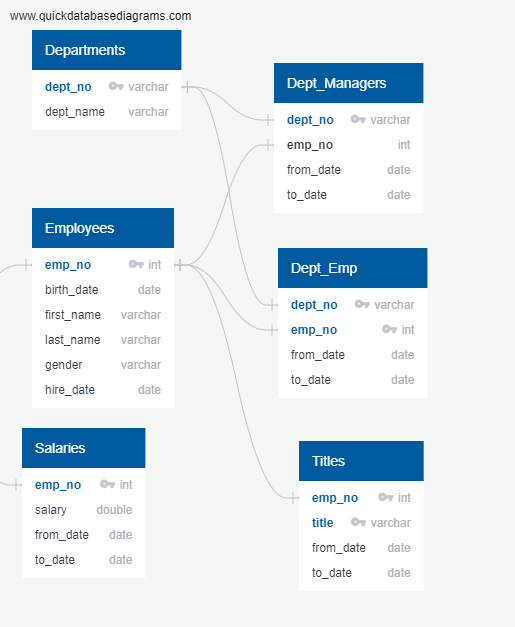
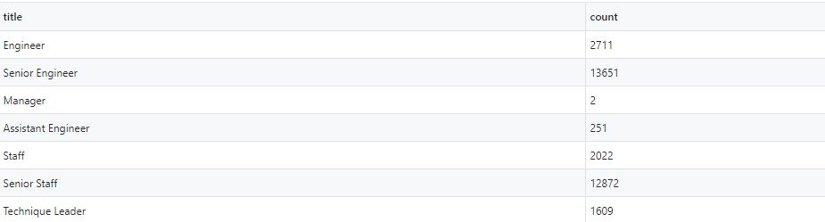

# Pewlett-Hackard-Analysis
This repo successfully compiles two lists of retiring and mentorship eligible employees. Data tables were created consisting of these individuals, as well as summary dataframes grouped by employee title (manager, engineer, etc.).

## The Problem
The problem faced in this repo was the sheer amount of data on employees that was provided for analysis. With the number of rows in the multiple thousands, it is obvious why a SQL query was used to narrow the list for analysis. We were trying to learn about the employees that were nearing retirement age based on their birth date. Another problem was that the excel data provided was in 6 separate excel sheets. This meant we had to pull from different data sheets to gather and pinpoint what we were looking for. To begin with, an ERD was created, as seen below. 

## The Solution - see schema.SQL for code
Using SQL, this code parses through the data and joins the tables together in order to get the results that were required for analysis. It also involved filtering the data in order to only include current employees for the mentorship program as well as for the birth date of the employee. After exporting the two lists of data containing these employees' names and titles, a summary chart was created for each list, in which the counts of retirement (top) and mentorship (bottom) eligibilities are provided by title (below). For a full list of the employees, see the data folder - (retiring_emps.csv & mentorship_employees.csv).

---

## Analysis
From the charts, we can see that there are many senior engineers and senior staff nearing the retirement mark. This makes sense considering they have the title 'Senior,' probably since they have been working there a little longer or have some experience in the field. A future analysis could include a salary analysis based on birth date, hire date, gender, and title to assess the company's economic equality.
